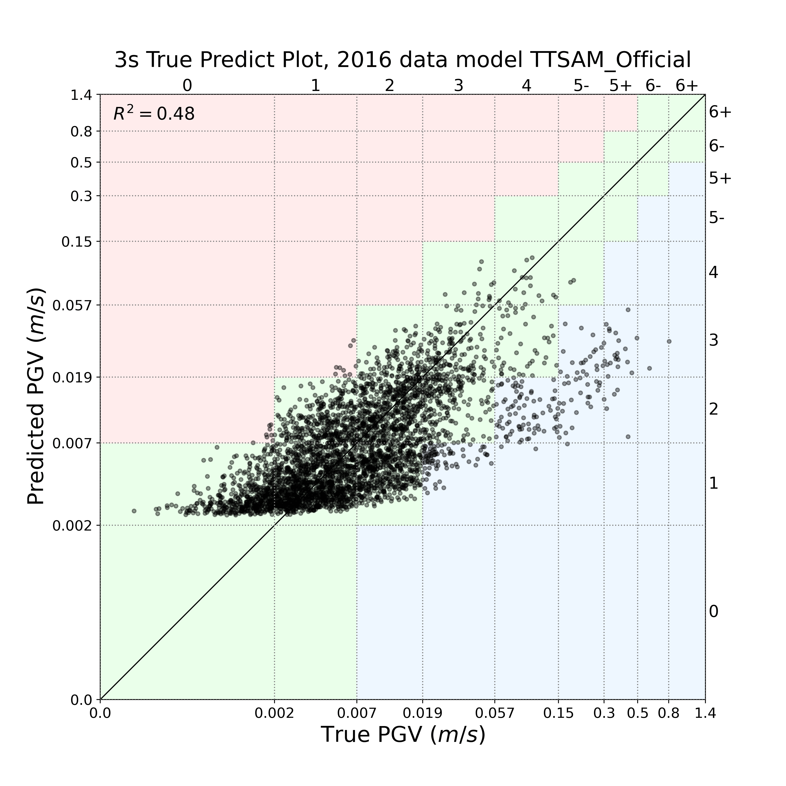

# TT-SAM: Taiwan Transformer Shaking Alert Model

<p align="left">
  <a href="https://doi.org/10.5281/zenodo.18885307">
    
  </a>
  <a href="https://doi.org/10.5281/zenodo.18923222">
    
  </a>
  
  
  
  
</p>

---

This repository contains the PyTorch implementation of:
> **"A Deep Learning Framework for Peak Ground Velocity Prediction Using Multi-Station Velocity Waveforms: The Taiwan Transformer Shaking Alert Model (TT-SAM)"**

## Overview

**TT-SAM** is a regional earthquake early warning (EEW) framework for **Peak Ground Velocity (PGV)** prediction.

It integrates multi-station waveform observations and physical seismic features to deliver reliable shaking estimates from the early P-wave stage, and updates predictions continuously as new waveform segments arrive.

### Key Features
- **Multi-feature fusion**: Raw velocity, low-frequency waveform branch, and physical features (e.g., Pd, CAV, TP).
- **Rolling update**: Predictions can be generated at any user-defined time point after waveform arrival; 3s, 5s, 7s, 10s, 13s, and 15s are default evaluation examples.
- **Transformer-based spatial modeling**: Learns station-to-station spatial context.

---

## Repository Structure

- **src/**
  - **models/**: TT-SAM architecture implementation.
    - Core file: `CNN_Transformer_Mixtureoutput_TEAM.py`
  - **preprocess/**: Data preparation pipeline.
  - **training/**: Model training scripts.
  - **utils/**: Dataset and waveform utility functions.
- **analysis/**: Performance analysis and plotting modules.
- **data/**
  - **raw/**: Raw data files.
  - **processed/**: Data generated by scripts in `src/preprocess`.
- **saved_models/**: Pretrained model weights (e.g., `TTSAM_Official.pt`).
- **result/**
  - **figures/model_TTSAM_Official_analysis/** and **tables/model_TTSAM_Official_analysis/**: Model outputs reported in our paper.

---

## Installation

```bash
# Clone the repository
git clone https://github.com/yuhengchen54/TT-SAM.git
cd TT-SAM

# (Recommended) create a virtual environment
python -m venv .venv
# Windows
.venv\Scripts\activate

# Install core dependencies
pip install torch numpy pandas scipy scikit-learn matplotlib obspy h5py tqdm mlflow
```

---

## Demo Dataset (Quick Start)

If you wish to test the model or scripts without performing the full preprocessing pipeline, we provide a **Demo Dataset** on Zenodo. This dataset includes pre-processed HDF5 files ready for training and inference.

- **Zenodo Repository**: [10.5281/zenodo.18885307](https://doi.org/10.5281/zenodo.18885307)
- **Contents**: 
  - `TSMIP_2016_demo.hdf5`: Processed waveform data with physical features (Pd, CAV, TP).
  - Sample catalogs and metadata.

**To use this dataset:**
1. Download the files from Zenodo.
2. Place the HDF5 file into the `data/processed/` directory.
3. You can then skip the `src/preprocess` steps and proceed directly to **Training** or **Evaluation**.

---

## How to Use

### 1) Model Architecture
The main model described in the paper is implemented in:

- [src/models/CNN_Transformer_Mixtureoutput.py](src/models/CNN_Transformer_Mixtureoutput.py)

### 2) Data Preprocessing (Demo Pipeline)
Detailed preprocessing steps are documented in [src/preprocess/README.md](src/preprocess/README.md).

### 3) Training
Detailed training instructions are documented in [src/training/README.md](src/training/README.md).

### 4) Inference & Evaluation
Detailed inference and evaluation instructions are documented in [src/training/README.md](src/training/README.md).

---

## Performance (Test Set)

### Dynamic Prediction Evolution

*Animation: True vs. Predicted PGV scatter plots from 3s to 13s after the initial P-wave arrival.*

### Key Observations:
1. **Time-Dependent Refinement:** The animation shows how TT-SAM refines its prediction as the data window grows from 3s to 13s after the first station triggers.
2. **Early Estimates:** Even with only 3 seconds of waveform data after the P-wave arrival, the model provides a reliable initial PGV estimate.
3. **Stability:** As more waveform information and spatial context from multiple stations are integrated over time, the prediction converges, leading to higher $R^2$ values and reduced residuals.
4. **Intensity Scale:** The background colored grids correspond to the Taiwan seismic intensity scale thresholds for PGV.

---

## Citation

If you find this work useful for your research, please cite our paper:

```bibtex
@article{chen2026ttsam,
  title   = {A Deep Learning Framework for Peak Ground Velocity Prediction Using Multi-Station Velocity Waveforms: The {Taiwan} Transformer Shaking Alert Model ({TT-SAM})},
  author  = {Chen, Yu-Heng and Chan, Chung-Han and Chang, Chieh-Chen and Ma, Kuo-Fong},
  journal = {Submitted to Journal of Geophysical Research: Machine Learning and Computation},
  year    = {2026},
  url     = {https://github.com/yuhengchen54/TT-SAM}
}
```

**Software/Repository DOI:**

If you use this repository, please also cite:

```bibtex
@software{chen2026ttsam_repo,
  author    = {Chen, Yu-Heng and Chan, Chung-Han and Chang, Chieh-Chen and Ma, Kuo-Fong},
  title     = {{TT-SAM}: Taiwan Transformer Shaking Alert Model},
  year      = {2026},
  publisher = {Zenodo},
  doi       = {10.5281/zenodo.18923222},
  url       = {https://doi.org/10.5281/zenodo.18923222}
}
```

**Data Citation:**

If you use the demo dataset provided on Zenodo, please cite it as follows:

```bibtex
@dataset{chen2026ttsam_dataset,
  author    = {Chen, Yu-Heng and Chan, Chung-Han and Chang, Chieh-Chen and Ma, Kuo-Fong},
  title     = {Demo Dataset for {TT-SAM}: {Taiwan} Transformer Shaking Alert Model},
  year      = {2026},
  publisher = {Zenodo},
  version   = {v1},
  doi       = {10.5281/zenodo.18885307},
  url       = {https://doi.org/10.5281/zenodo.18885307}
}
```